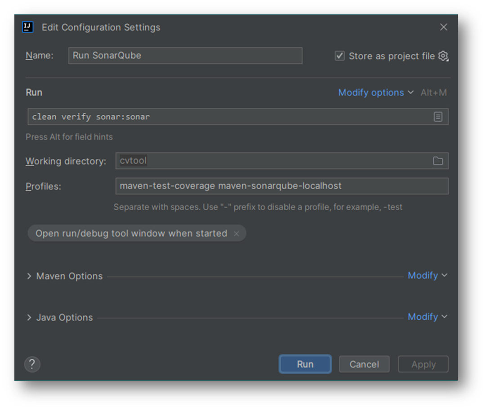

= Tips & tricks

== Run MongoDB locally

Use `docker compose` to start the CVtool application as usual, and then stop/kill the _cvtool-frontend_ and _cvtool-backend_ containers:

[source,sh]
....
docker compose -f docker-compose.yaml --env-file=/secret/.env up -d
docker container stop \
  "$(docker ps -aqf 'ancestor=bransom/cvtool-backend')" \
  "$(docker ps -aqf 'ancestor=bransom/cvtool-frontend')"
....

== Run SonarQube locally

Initialize local SonarQube server:

* Start Docker and execute this command

[source,sh]
....
docker run -d --name sonarqube -e SONAR_ES_BOOTSTRAP_CHECKS_DISABLE=true -p 9000:9000 --restart always sonarqube:latest
....
* Open a browser and go to http://localhost:9000/.
* Login with _admin_ / _admin_ and change the password.
* Go to http://localhost:9000/admin/users and generate a token. +
Make sure you keep a copy of the token available.
* Edit your local Maven config file `settings.xml` (see http://localhost:9000/documentation/analysis/scan/sonarscanner-for-maven/[here]) and add

[source,xml]
....
<settings xmlns="http://maven.apache.org/SETTINGS/1.0.0">
    <pluginGroups>
        <pluginGroup>org.sonarsource.scanner.maven</pluginGroup>
    </pluginGroups>
    <profiles>
        <profile>
            <!-- Run Sonar scan using local SonarQube server. -->
            <id>maven-sonarqube-localhost</id>
            <properties>
                <sonar.host.url>http://localhost:9000/</sonar.host.url>
                <sonar.token>[YOUR_SONARQUBE_LOCALHOST_ADMIN_TOKEN]</sonar.token>
            </properties>
        </profile>
    </profiles>
</settings>
....

* Create a _Run Configuration_ in IDEA for the following Maven task:
....
mvn clean verify sonar:sonar -P maven-test-coverage,maven-sonarqube-localhost
....

After the Maven task has completed, the scan results are available in http://localhost:9000/[your local SonarQube] in project *cvtool*.

IMPORTANT: The database of this local SonarQube only lives in the *sonarqube* Docker container. +
You can safely stop and start the container, but _do not delete it_ if you want to preserve your scan results!

=== SonarLint plugin [Optional]

You can install the SonarLint plugin in IntelliJ and connect to your SonarQube at http://localhost:9000/.
That allows you to easily jump to the associated source code when reviewing issues in SonarQube.

When creating the _SonarQube connection_, select *Token* and enter +
`[YOUR_SONARQUBE_LOCALHOST_ADMIN_TOKEN]`.
