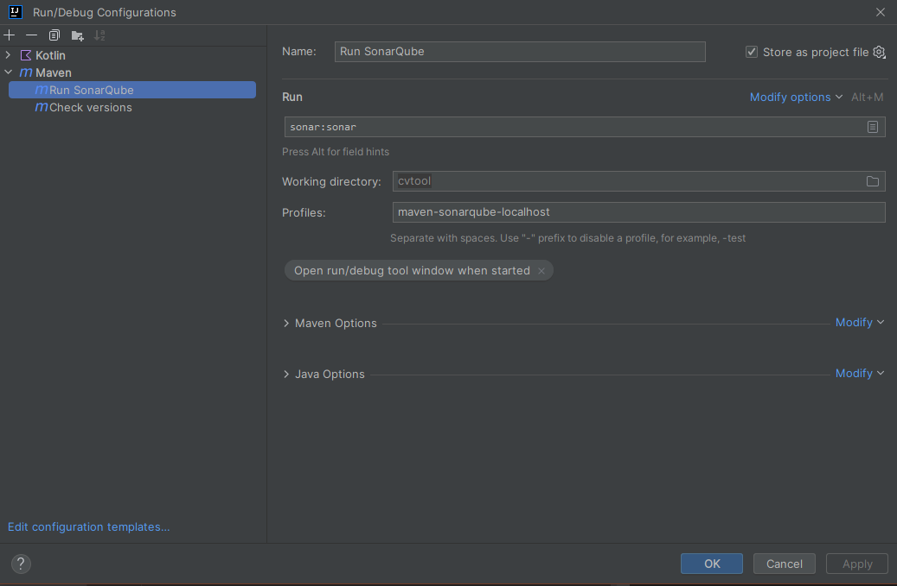

= Tips & tricks

== Run SonarQube locally

Initialize local SonarQube server:

* Start Docker and execute this command:
....
docker run -d --name sonarqube -e SONAR_ES_BOOTSTRAP_CHECKS_DISABLE=true -p 9000:9000 sonarqube:latest
....
* Open a browser and go to http://localhost:9000/.
* Login with _admin_ / _admin_ and change the password.
* Create a _Run Configuration_ in IDEA for the following Maven task:
....
mvn sonar:sonar -P maven-sonarqube-localhost
....

* Edit your local Maven config file `settings.xml` (see http://localhost:9000/documentation/analysis/scan/sonarscanner-for-maven/[here]) and add
....
<settings>
    <pluginGroups>
        <pluginGroup>org.sonarsource.scanner.maven</pluginGroup>
    </pluginGroups>
    <profiles>
        <profile>
            <!-- Run Sonar scan using local SonarQube server. -->
            <id>maven-sonarqube-localhost</id>
            <properties>
                <sonar.host.url>http://localhost:9000/</sonar.host.url>
                <sonar.login>admin</sonar.login>
                <sonar.password>[YOUR_SONARQUBE_LOCALHOST_ADMIN_PASSWORD]</sonar.password>
            </properties>
        </profile>
    </profiles>
</settings>
....

Make sure you ran `mvn clean verify` before executing the Maven sonar task.
After the Maven task has completed, the scan results are available in http://localhost:9000/[your local SonarQube] in project *cvtool*.

IMPORTANT: The database of this local SonarQube only lives in the *sonarqube* Docker container. +
You can safely stop and start the container, but _do not delete it_ if you want to preserve your scan results!

=== SonarLint plugin [Optional]

You can install the SonarLint plugin in IntelliJ and connect to your SonarQube at http://localhost:9000/.
That allows you to easily jump to the associated source code when reviewing issues in SonarQube.

When creating the _SonarQube connection_, select *Login / Password* and enter +
`admin` / `[YOUR_SONARQUBE_LOCALHOST_ADMIN_PASSWORD]`.